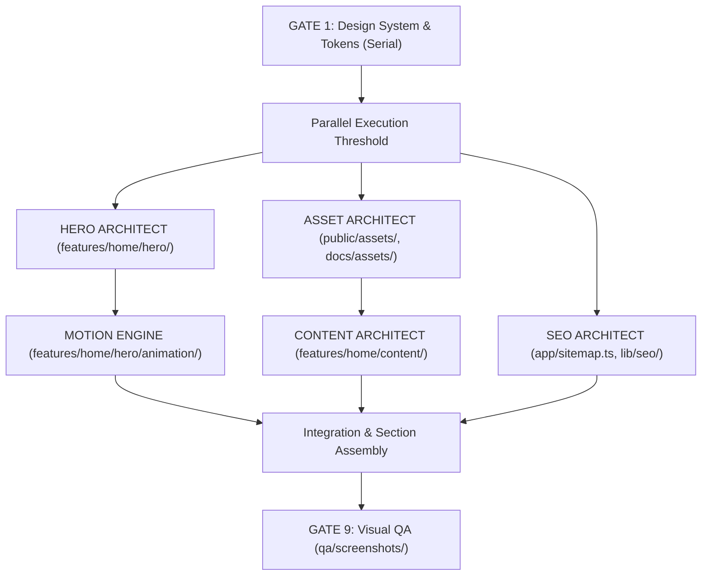

# OXLATE TASK BOARD & PARALLEL WORKFLOW

--------------------------------------------------
01. PHASE GATES & TASK BOARD
--------------------------------------------------

| Gate | Task Description | Assigned Agent | Status | Deliverable / Output |
|:---|:---|:---|:---|:---|
| **GATE 0** | Reconcile planning docs, create `/docs/`, archive old files, define agent OS | AGENT 01 (Doc Architect) | APPROVED | `/docs/`, `/reference/`, `/.agent/`, `START-HERE.md` |
| **GATE 1** | Fresh codebase foundation (Next.js 16 app router shell, tokens, font loaders, layer system L0-L8, routing skeleton, Playwright screenshot harness). Zero UI components. | AGENT 02 (Design System) | PENDING | `app/`, `styles/`, `qa/playwright.config.ts` |
| **GATE 2** | Hero STATE 1 — Arrival (Giant X, headline, bronze CTA, CAD rules) | AGENT 03 (Hero Architect) | PENDING | `features/home/hero/` |
| **GATE 3** | Hero STATE 2 — Construction (Scroll translation, datum rules, 42° diagonal arm lines) | AGENT 04 (Motion Engine) | PENDING | `features/home/hero/` |
| **GATE 4** | Hero STATE 3 — Resolution (Service rail, resolved composition, micro-elements) | AGENT 03 / 04 | PENDING | `features/home/hero/` |
| **GATE 5** | Hero complete + reverse scroll + mobile monument without scroll-jacking | AGENT 04 / 05 | PENDING | Responsive hero + `qa/screenshots/` |
| **GATE 6** | Core sections rebuild (Capabilities threshold bridge, Work, Approach, About, Contact, Footer) | AGENT 06 (UI/Sections) | PENDING | `features/home/sections/` |
| **GATE 7** | Asset system (`HERO-SVG-01` vector CAD grid, `OG-IMAGE-01`) | AGENT 07 (Assets) | PENDING | `/public/assets/`, `/docs/assets/05-GENERATION-PROMPTS.md` |
| **GATE 8** | SEO, schema & discoverability (Metadata, JSON-LD, sitemap.ts, robots.ts) | AGENT 08 (SEO) | PENDING | `app/sitemap.ts`, `app/robots.ts` |
| **GATE 9** | Full visual, motion, performance & accessibility QA | AGENT 09 (QA) | PENDING | Visual QA Verification Report |

--------------------------------------------------
02. PARALLEL EXECUTION GRAPH (POST-GATE 1)
--------------------------------------------------

--------------------------------------------------
03. FILE OWNERSHIP RESTRICTIONS
--------------------------------------------------
No two subagents may modify the same file concurrently:
- Hero Architect: `features/home/hero/`
- Design System: `styles/`, `tokens/`, `components/ui/`
- SEO Agent: `app/sitemap.ts`, `app/robots.ts`, `lib/seo/`
- Content Agent: `features/home/content/`
